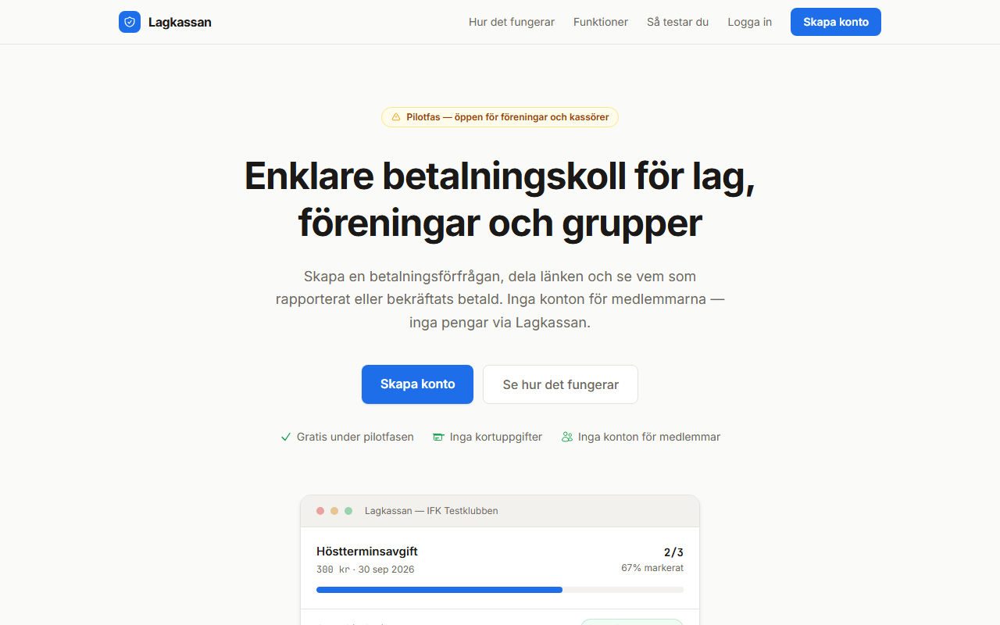
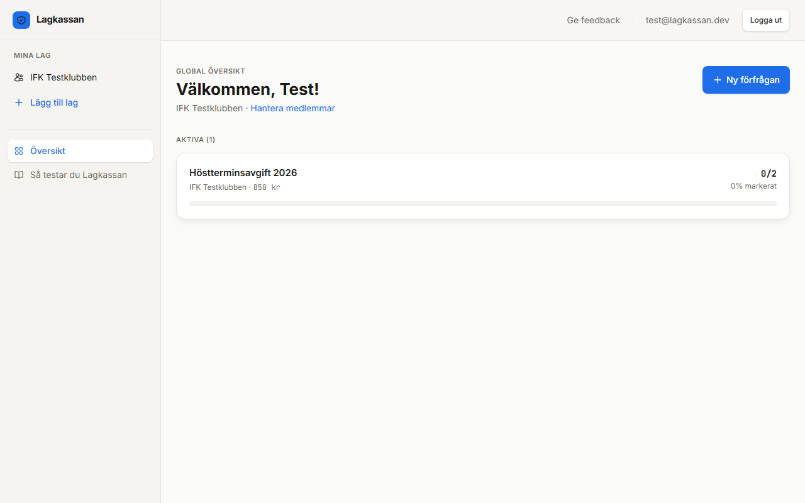
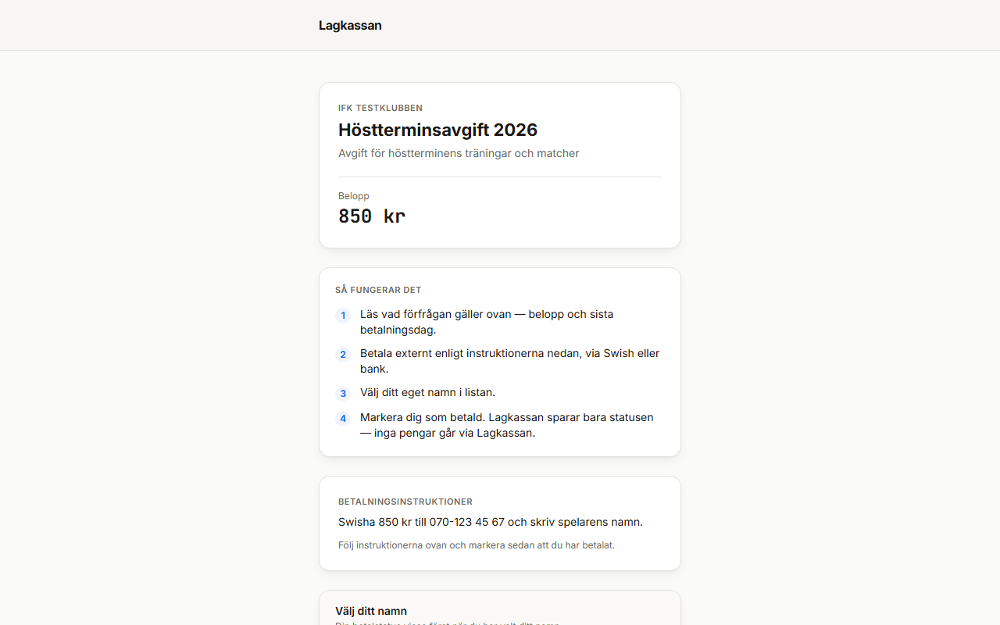

# Lagkassan

**A payment-collection coordination tool for Swedish sports clubs and community associations.**

[](https://github.com/vallestar-oss/lagkassan/actions/workflows/ci.yml)
[](LICENSE)

🔗 **Live demo:** [lagkassan.vercel.app](https://lagkassan.vercel.app)

---

## The problem

Treasurers in sports clubs and associations chase members for fees over WhatsApp,
track who's paid in a spreadsheet, and send reminders one by one. There's no
shared link, no live status, and no single source of truth — just hours of
manual bookkeeping every season.

## The solution

Lagkassan lets a treasurer create a payment request in seconds, share **one
public link**, and watch a live paid/unpaid overview fill in as members report
their payment. Members open the link, pick their name from a roster the
treasurer controls, and mark themselves paid — no account, no app, no
friction.

Lagkassan **never touches money**. The treasurer supplies their own payment
instructions (Swish, bank transfer, whatever the club already uses); members
pay externally and simply report it in Lagkassan. This is a deliberate scope
decision — see [Design decisions](#design-decisions) below.

## Screenshots

| Landing page | Treasurer dashboard | Public payment link |
|---|---|---|
|  |  |  |

See also: [collection detail view](docs/screenshots/collection.png) — the share link, QR code, and payment-status breakdown for a single request.

## Tech stack

| Layer | Technology |
|---|---|
| Framework | Next.js 16 (App Router, Server Actions, Turbopack) |
| UI | React, Tailwind CSS |
| Database & Auth | Supabase (PostgreSQL + Row-Level Security) |
| Language | TypeScript |
| Deployment | Vercel |

## Core features

- **Payment collections** — a treasurer creates a request with a title, amount, and deadline
- **One public link per collection** — shareable in a group chat, no per-member invites
- **Roster-based self-service** — members pick their own name from a list the treasurer controls; the server validates it belongs to the collection
- **Live status dashboard** — paid / unpaid per member, updated on each page load, no manual refresh needed
- **Multi-team support** — a treasurer can manage several clubs/teams, each with its own roster and collections
- **CSV export** — for treasurers who still need a spreadsheet for the annual meeting
- **Auth-gated dashboard, public payment page** — two very different trust boundaries, enforced by RLS + server-side role checks, not just UI

## Architecture

```
Browser
  │
  ├── /dashboard, /teams, /collections  → auth-gated, server-rendered
  │     └── Server Actions mutate the DB directly (no REST layer)
  │
  └── /p/[slug]  → public payment page, no auth
        └── Server Action: submitMockPayment
              • reads the collection amount from the DB — the client never sets it
              • validates the selected member belongs to this collection
              • writes a payment record
```

**Key design decisions:**

- **Amount is server-authoritative.** The client submits only a member ID; the
  server looks up the amount from the collection record. There is no
  client-controlled amount field anywhere in the payment path.
- **Server Actions over API routes** for mutations, to keep the auth context
  close to the database call and avoid a parallel REST surface to secure.
- **Row-Level Security on every table**, plus an explicit
  [defense-in-depth check](src/lib/auth.ts) in server actions — RLS alone
  isn't trusted for the paths where the public payment policy is intentionally
  permissive.
- **Slug-based public URLs**, not sequential IDs, so collections can't be
  enumerated by guessing.

## Design decisions

**Why "mock" payments?** Lagkassan is a coordination layer, not a payment
processor. It never collects card details or moves money — the treasurer
posts their own Swish/bank details, members pay directly, and Lagkassan just
tracks who has reported paying. This was a deliberate MVP scope cut, not a
missing feature: it sidesteps PCI/PSD2 compliance entirely while still solving
the actual pain point (chasing people, not processing payments). A real Stripe
integration is scoped and documented in [docs/stripe-plan.md](docs/stripe-plan.md)
for if/when it's worth the added complexity.

**Database schema** lives entirely in [`supabase/migrations/`](supabase/migrations),
applied in filename order — no drifting schema snapshot to keep in sync.

## What I learned building this

- **RLS is a strong default, but not a substitute for application-level
  checks.** The public payment link needs an intentionally permissive insert
  policy (anyone with the link can report a payment) — which means every
  authenticated write path needed its own role check in code
  ([`assertTeamRole`](src/lib/auth.ts)), because relying on RLS alone would
  have let a treasurer of Team A read or edit Team B's data.
- **"Server-authoritative" isn't just a slogan — it changes what you build.**
  Once I decided the client can never set a payment amount or status, entire
  classes of validation logic disappeared. The hard part was auditing every
  form to make sure no hidden field ever carried that data — I found and
  removed a leftover `amount` input during a security pass.
- **Fail-open vs. fail-closed is a real decision, not a default.** The
  middleware intentionally passes requests through if Supabase env vars are
  missing, so the app doesn't hard-crash on a misconfigured preview deploy —
  but that only works because every protected mutation is *also* guarded at
  the server-action level. Relying on middleware alone would have been a
  silent security hole.
- **Ship the smallest thing that's still honest with users.** The FAQ and
  landing page say outright that Lagkassan doesn't handle money, instead of
  hiding "mock payments" behind vague copy — trust matters more for a
  treasurer-facing tool than feature completeness.

## Local setup

**Prerequisites:** Node.js 18+, a Supabase project.

```bash
git clone https://github.com/vallestar-oss/lagkassan.git
cd lagkassan
npm install
```

Copy `.env.local.example` to `.env.local` and fill in your Supabase project's
keys (Settings → API):

```
NEXT_PUBLIC_SUPABASE_URL=...
NEXT_PUBLIC_SUPABASE_ANON_KEY=...
SUPABASE_SERVICE_ROLE_KEY=...
```

Apply the database schema:

```bash
npx supabase db push   # or apply supabase/migrations/*.sql in order
```

Run the dev server:

```bash
npm run dev
```

Run the test suite (unit tests for the role-check and rate-limit logic — see
[`src/lib/auth.test.ts`](src/lib/auth.test.ts) and
[`src/lib/rateLimit.test.ts`](src/lib/rateLimit.test.ts)):

```bash
npm run test
```

Open [http://localhost:3000](http://localhost:3000) and create an account
through the signup flow.

## Security considerations

- The client never controls payment amount, member list, or collection status.
- All mutations go through authenticated Server Actions or narrow, explicit RLS policies.
- The public payment endpoint validates that the selected member belongs to the correct collection before writing.
- Rate limiting on public write/auth endpoints (in-memory, documented as pilot-scale — see [`src/lib/rateLimit.ts`](src/lib/rateLimit.ts)).

**Known gap, by design:** the public payment action self-reports
`status = 'paid'` with no external verification that money actually moved
(there's nothing to verify yet — no processor is wired up). In a real-money
version this becomes `status = 'pending'` on insert, with `paid` set
exclusively by a verified Stripe webhook — see
[docs/stripe-plan.md](docs/stripe-plan.md) for the full target architecture.

## Roadmap

- [ ] Real Stripe integration — webhook-verified paid status, no client trust
- [ ] Email receipts
- [ ] Partial payments / instalments
- [ ] Reminder automation
- [ ] Multi-currency support (currently SEK only)

## AI-assisted development

Built with AI-assisted development (Claude). Boilerplate, UI layout, and
repetitive CRUD logic were AI-generated; the security model, RLS policies,
payment flow, schema design, and all product decisions were manually
reviewed and directed.

## License

[MIT](LICENSE)
